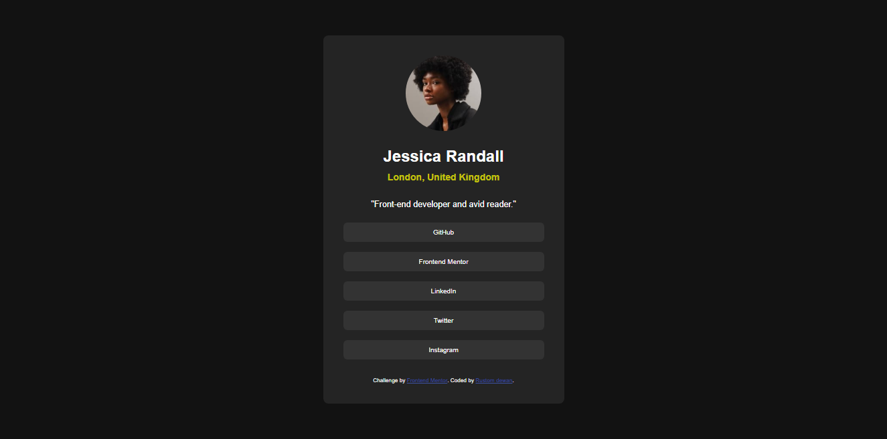

# Frontend Mentor - Social links profile solution

This is a solution to the [Social links profile challenge on Frontend Mentor](https://www.frontendmentor.io/challenges/social-links-profile-UG32l9m6dQ). Frontend Mentor challenges help you improve your coding skills by building realistic projects. 

## Table of contents
  - [Screenshot](#screenshot)
  - [Links](#links)
- [My process](#my-process)
  - [Built with](#built-with)
  - [What I learned](#what-i-learned)
  - [Continued development](#continued-development)
- [Author](#author)
### Screenshot

### Links

- Solution URL: (https://github.com/Rustom0/project1.git)
- Live Site URL: [Add live site URL here](https://your-live-site-url.com)

## My process
first create the body as a flex and create a container and mave the container and use text align to align eveythingin the middle 

### Built with

- Semantic HTML5 markup
- CSS custom properties
- Flexbox
- CSS Grid

### What I learned
learn about responsive website and when to use right element.

### Continued development

for using the best elemnt suited for the best website and when to use flex and how to manage the responisve website.

## Author

- Frontend Mentor - [@rustom0](https://www.frontendmentor.io/profile/Rustom0)
